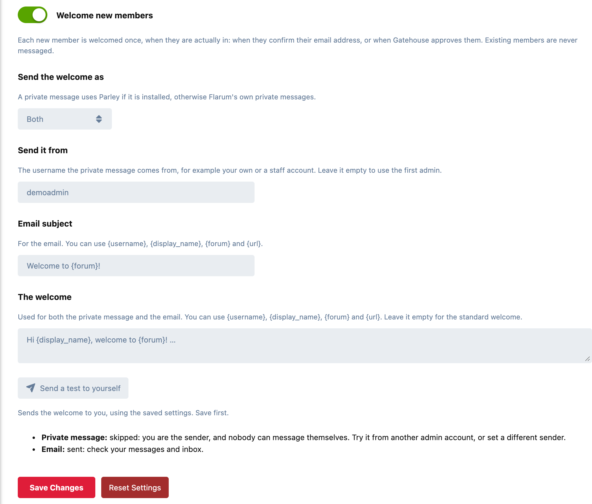

# Greeter

Welcome every new member with a private message, an email, or both, written in your own words and sent the moment they are actually in.



## When it sends

Not at sign-up. A welcome at sign-up reaches every bot that fills in the form, and greets people who can't post yet. Greeter waits until a member is really a member:

- **When they confirm their email address**, the usual case.
- **When they sign up already confirmed**, through a social login.
- **When [Gatehouse](https://github.com/ernestdefoe/gatehouse) approves them**, if you hold new sign-ups for approval. An approved applicant is welcomed once they have also confirmed their address.

Each member is welcomed **once**, however many of those happen. **Existing members are never messaged**, so installing Greeter on an established forum sends nothing to anyone.

## What it sends

- **A private message**, from the account you choose (your own, or a staff account). It uses **[Parley](https://github.com/ernestdefoe/parley)** if it's installed, otherwise **Flarum's own private messages**.
- **An email**, in the forum's own email style.
- **Or both.**

Write it once; the same text is used for both, with these filled in:

| Placeholder | Becomes |
|---|---|
| `{display_name}` | the member's display name |
| `{username}` | their username |
| `{forum}` | your forum's title |
| `{url}` | your forum's address |

Leave the text empty for a friendly standard welcome.

## Try it on yourself

**Send a test to yourself** delivers the welcome to you, from the saved settings, and says what happened to each part in plain words: sent, or why not. A test never counts as your welcome.

## Good to know

- **Sending happens in the background**, so confirming an email or approving someone never waits on a mail server.
- **A refused message doesn't block the email.** If the member's own privacy settings refuse messages from the sender, that is logged and the email still goes, when the email is switched on.
- **Apostrophes and ampersands survive.** "Don't be shy & say hello" arrives exactly as written, in the message and the email.

## Installation

```sh
composer require ernestdefoe/greeter
php flarum migrate
php flarum cache:clear
```

Then enable **Greeter**, switch on **Welcome new members**, and send yourself a test.

## Updating

```sh
composer update ernestdefoe/greeter
php flarum migrate
php flarum cache:clear
```

## Licence

MIT. See [LICENSE](LICENSE).
